# Firebase App Distribution via fastlane

Purpose of the project
======================

:boom: This project will help you distribute your app with the power of Firebase App Distribution and fastlane. As you may know, Firebase App Distribution is a replacement of [Beta](https://docs.fabric.io/android/beta/installation.html). This sample also guides you how to organize a multi-build types and a multi-flavor Android application. 

<p align="center">
  <a href="https://console.firebase.google.com/u/0/"></a>
  <a href="https://fastlane.tools/"></a>
</p>

Table of contents
=================

<!--ts-->
   * [Firebase App Distribution via fastlane](#purpose-of-the-project)
   * [Tools and components](#tools-and-components)
      * [Firebase App Distribution](#firebase-app-distribution)
      * [fastlane](#fastlane)
   * [To-do list](#to-do-list)
      * [Firebase side](#firebase-side)
        * [Create a Firebase project](#create-a-firebase-project)
        * [Register your app with Firebase](#register-your-app-with-firebase)
        * [Add a Firebase configuration file](#add-a-firebase-configuration-file)
        * [Add Firebase SDKs to your app](#add-firebase-sdks-to-your-app)
      * [Android side](#android-side)
        * [Prepare Firebase resources](#prepare-firebase-resources)
        * [Setup fastlane](#setup-fastlane)
        * [Setup Firebase CLI](#setup-firebase-cli)
      * [Firebase Console side](#firebase-console-side)
        * [Add testers and groups](#add-testers-and-groups)
        * [Create an invite link](#create-an-invite-link)
        * [Distribute app to testers](#distribute-app-to-testers)
      * [Android Device side](#android-device-side)
        * [Download app via email](#download-app-via-email)
        * [Access app via App Tester](#access-app-via-app-tester)
      * [Run the lane](#run-the-lane)
   * [Plugins - Bonus*](#plugins---bonus)
        * [Increment Version Code](#increment-version-code)
        * [Get Version Name](#get-version-name)
        * [dotenv](#dotenv)
   * [Resources](#resources)
   * [Find this docs useful?](#find-this-docs-useful)
   * [License](#license)
<!--te-->

Tools and components
====================

Firebase App Distribution
-------------------------

:fire: **Firebase App Distribution** makes distributing your apps to trusted testers painless. By getting your apps onto testers' devices quickly, you can get feedback early and often. And, if you use Crashlytics in your apps, you’ll automatically get stability metrics for all your builds, so you know when you’re ready to ship. Please visit [Firebase App Distribution page](https://firebase.google.com/docs/app-distribution) fore more detail.

fastlane
--------

:rocket: **fastlane** is the easiest way to automate beta deployments and releases for your iOS and Android apps. 🚀 It handles all tedious tasks, like generating screenshots, dealing with code signing, and releasing your application. Please visit [fastlane page](https://docs.fastlane.tools/) fore more detail.

To-do list
==========

This to-do list is consist of 5 sections. We will see how both Firebase and Android side work respectively.

Firebase side
-------------

In this part, we will learn how to register our app via [Firebase Console](https://console.firebase.google.com/u/0/).

#### Create a Firebase project

Before you can add Firebase to your Android app, you need to create a Firebase project to connect to your Android app. [Visit Understand Firebase Projects](https://firebase.google.com/docs/projects/learn-more) to learn more about Firebase projects.

1. In the [Firebase console](https://console.firebase.google.com/u/0/), click **Add project**, then select or enter a **Project name**.
<p align="left" style="padding-left: 15px">
    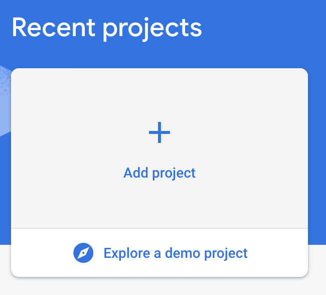
</p>

2. Click **Continue**.
3. Click **Create project**.

#### Register your app with Firebase

1. In the center of the [Firebase console's project overview page](https://console.firebase.google.com/u/0/), click the **Android** icon to launch the setup workflow.
2. Enter your app's [application ID](https://developer.android.com/studio/build/application-id) in the **Android package name** field. An *application ID* is sometimes referred to as a **package name** (**e.g.** com.yourcompany.yourproject)
3. Enter other app information as prompted by the setup workflow. (SHA-1)
   * To get the debug certificate fingerprint, copy and paste below code block into your Terminal:
   `keytool -list -v \ -alias androiddebugkey -keystore ~/.android/debug.keystore`
   * The default password for the debug keystore is android. The keytool then prints the fingerprint to the terminal. For example:
   `Certificate fingerprint: SHA1: DA:39:A3:EE:5E:6B:4B:0D:32:55:BF:EF:95:60:18:90:AF:D8:07:09`
4. Click **Register app**.

#### Add a Firebase configuration file

1. Add the Firebase Android configuration file to your app:
    * Click **Download google-services.json** to obtain your Firebase Android config file (google-services.json).
    * Move your config file into the module (app-level) directory of your app. **This is not required anymore, hereafter you can move all required info into strings resources. This is explained in the [Android side](#android-side)**
    
      ```
      dependencies {
      // Add the following line:
      classpath 'com.google.gms:google-services:4.3.2'  // Google Services plugin
      }
      ```
    * In your module (app-level) Gradle file (usually app/build.gradle), add a line to the bottom of the file.
    
        ```
        android {
    
        }

        // Add the following line to the bottom of the file:
            apply plugin: 'com.google.gms.google-services'  // Google Play services Gradle plugin
        ```
#### Add Firebase SDKs to your app

1. To your module (app-level) Gradle file (usually app/build.gradle), add the dependencies for the Firebase products that you want to use in your app.
    ```
    dependencies {
    // ...

    // Add the Firebase SDK for Google Analytics
    implementation 'com.google.firebase:firebase-analytics:17.2.1'

    // Add the SDKs for any other Firebase products you want to use in your app
    // For example, to use Firebase Authentication and Cloud Firestore
    implementation 'com.google.firebase:firebase-auth:19.1.0'
    implementation 'com.google.firebase:firebase-firestore:21.2.1'

    // Getting a "Could not find" error? Make sure that you've added
    // Google's Maven repository to your root-level build.gradle file
    }
    ```
2. Sync your app to ensure that all dependencies have the necessary versions.
3. If you added Analytics, run your app to send verification to Firebase that you've successfully integrated Firebase. Otherwise, you can skip the verification step. **Firebase usually needs a verification for distribution so that you need add Analytics and run the app.**

Android side
------------

In this part, we will configure our Android application to allow it to be in touch with **Firebase App Distribution**.

#### Prepare Firebase resources

When you work on a project that has multiple build types or flavors, you will most likely face weird issues. For example:

`Could not find google-services.json while looking in [src/flavor1/debug, src/debug, src/flavor1]`

To suppress such error, you have to create both **src** and all **flavor** folders and move **google-services.json** file into each one. This could be costly especially you have several build types and flavors. Now we will see how to use only resources instead of **google-services.json** file and obtain the same result for our app.

1. Add the **google-services.json** file and the plugin to your project as described in the [Add Firebase to your Android Project](https://firebase.google.com/docs/android/setup) guide.
2. Run `./gradlew :app:assembleDebug` to force the plugin to do its job.
3. Open the generated file `app/build/generated/res/google-services/debug/values/values.xml` and inspect the contents, it should look something like this:

```
<?xml version="1.0" encoding="utf-8"?>
<resources>

    <! -- Present in all applications -->
    <string name="google_app_id" translatable="false">1:1035469437089:android:73a4fb8297b2cd4f</string>

    <! -- Present in applications with the appropriate services configured -->
    <string name="gcm_defaultSenderId" translatable="false">1035469437089</string>
    <string name="default_web_client_id" translatable="false">337894902146-e4uksm38sne0bqrj6uvkbo4oiu4hvigl.apps.googleusercontent.com</string>
    <string name="ga_trackingId" translatable="false">UA-65557217-3</string>
    <string name="firebase_database_url" translatable="false">https://example-url.firebaseio.com</string>
    <string name="google_api_key" translatable="false">AIzbSyCILMsOuUKwN3qhtxrPq7FFemDJUAXTyZ8</string>
    <string name="google_crash_reporting_api_key" translatable="false">AIzbSyCILMsOuUKwN3qhtxrPq7FFemDJUAXTyZ8</string>
    <string name="project_id" translatable="false">mydemoapp</string>

</resources>
```
4. Copy each of the <string> resources from that file into your app’s own strings.xml file (or any XML resources file you want).
5. Remove the google-services plugin from your app and delete the google-services.json file, you don’t need them anymore!

The reason that is underneath this way according to the [Firebase docs](https://firebase.google.com/docs/projects/multiprojects#support_multiple_environments_in_your_android_application)

>Because this provider is just reading resources with known names, another option is to add the string resources directly to your app instead of using the Google Services gradle plugin. You can do this by:
>
> * Removing the google-services plugin from your root build.gradle
> * Deleting the google-services.json from your project
> * Adding the string resources directly
> * Deleting apply plugin: 'com.google.gms.google-services' from your app build.gradle

#### Setup fastlane

1. Navigate to your app folder or on Terminal inside Android Studio, type the command below:
    
    `sudo gem install fastlane -NV`
2. Verify that the installation was successful by typing this command in the CLI:

    `fastlane -version`
3. Run `fastlane init`
4. Provide the package name for your application when asked (**e.g.** com.thedancercodes.fastlanedroid)
5. Press enter when asked for the path to your json secret file
6. Answer ’n’ when asked if you plan on uploading info to Google Play via Fastlane (we can set this up later)

That’s it! ***Fastlane*** will automatically generate a configuration for you based on the information provided.
This process generates our App file and Fastfile. Below is a screenshot of the Fastlane directory in your project containing these files.
<p align="left">
    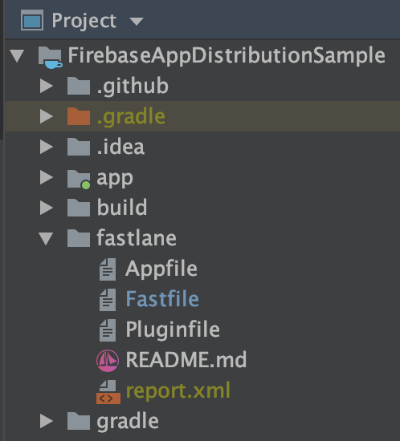
</p>

**Appfile:** Defines configuration information that is global to your app.

**Fastfile:** Defines different lanes that drive the behavior of fastlane to do different tasks.

*The Fastfile defines what steps run & in what order Fastlane runs them.
A group of steps is called a lane*

Below are code snippets show the contents of the **Fastfile** & **Appfile**:

| App file | Fast File
|:----------------:|:---------------:|
| 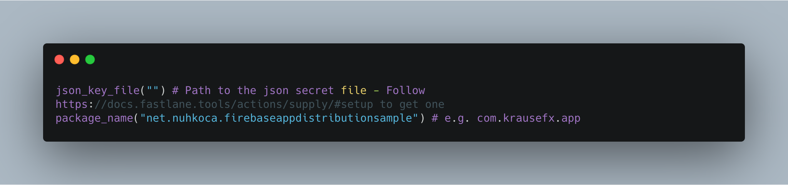  | 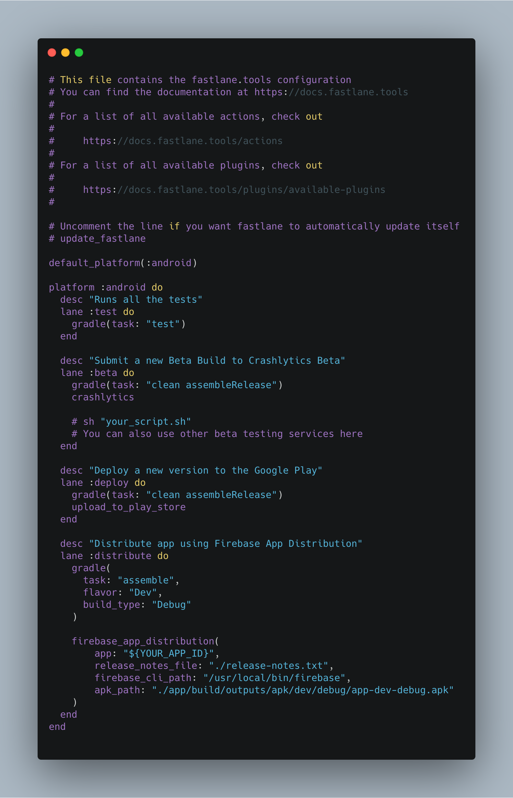

There are something we need to add into our **Fastfile** in order to have lane working correctly.

1. **app:** This key indicates our **APP_ID**. This is found on [Firebase console](). Respectively;

   * Click on settings gear icon.
   <p align="left" style="padding-left: 20px">
   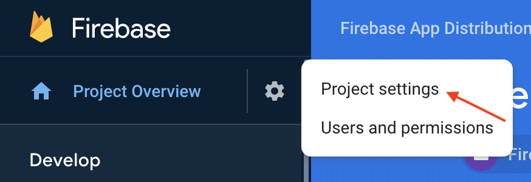
   </p>
    
   * Scroll down a bit and copy **APP_ID**.
   <p align="left" style="padding-left: 20px">
   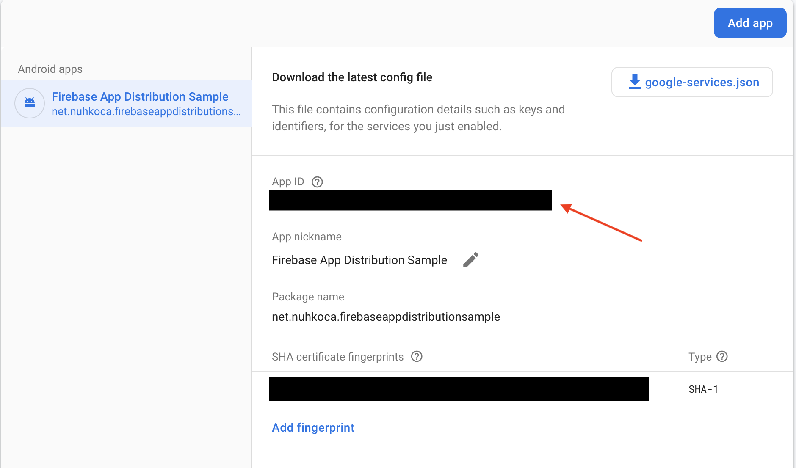
   </p>

2. **release_notes_file:** A file that includes changelog.
3. **testers_file:** A file that includes testers. If we specify it we can skip [Distribute app to testers](#distribute-app-to-testers) since *fastlane* will handle distribution automatically.
3. **firebase_cli_path:** A path to Firebase CLI - Please see [Setup Firebase CLI](#setup-firebase-cli)
4. **apk_path:** Refers to our apk path that we want to distribute.

#### Setup Firebase CLI

:clipboard: The Firebase CLI ([GitHub](https://github.com/firebase/firebase-tools)) provides a variety of tools for managing, viewing, and deploying to Firebase projects.

1. Install plugin `firebase_app_distribution` for fastlane by run this in your terminal

    `fastlane add_plugin firebase_app_distribution`
    
2. Check that if in your Pluginfile like this
<p align="left" style="padding-left: 15px">
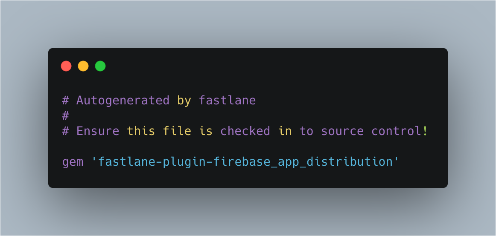
</p>

3. Next, install Firebase CLI by running this in your terminal

    `curl -sL firebase.tools | bash`
4. Sign in your account to authorize Firebase by running
    
    `firebase login`
    
    * and you can log out anytime by running with the following command line
      
      `firebase logout`

5. In order to distribute your application, you need to build it first. You can check out [fastlane build actions](https://docs.fastlane.tools/actions/build_android_app/) for more options. Below code block is enough to build our application.

    ```
    gradle(
      task: "assemble",
      flavor: "MyFlavor",
      build_type: "Release" -> This could be Debug or any kind of custom build type.
    )
    ```
    
6. Now we need to add a **fastlane lane** to distribute our application. A common lane can look like;
<p align="left" style="padding-left: 15px">
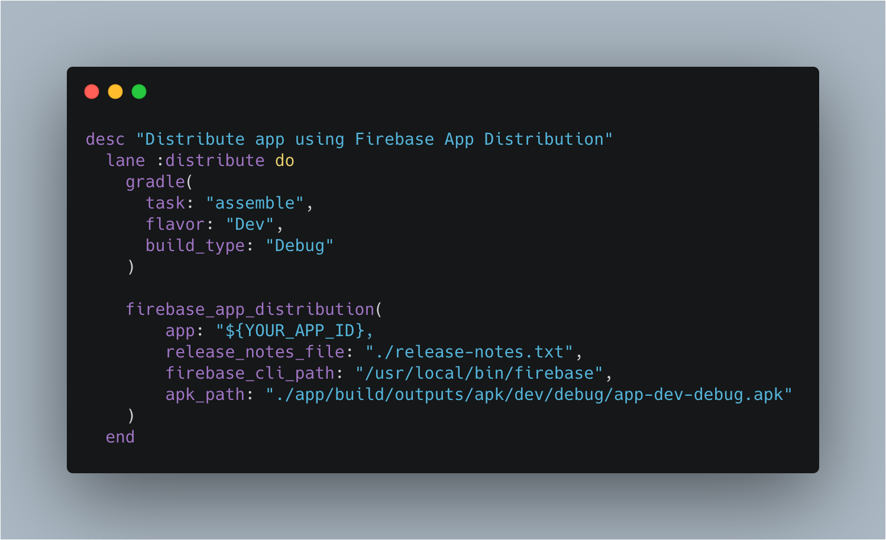
</p>

7. Final step is to run our lane. It is mentioned as a last step at the end of the docs. Please navigate to [Run the lane](#run-the-lane)

Firebase Console side
---------------------

We also need to have some settings on Firebase console in order to able to distribute our application such as defining testers, groups, invite links and so on.

#### Add testers and groups

1. First, navigate to **App Distribution** section on the console.
<p align="left" style="padding-left: 15px">
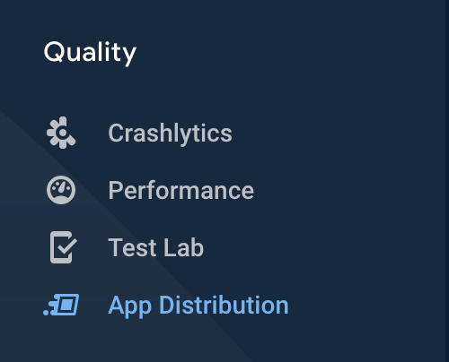
</p>

2. Navigate to *Testers & Groups* that we can create testers or groups which will receive app updates via **App Tester** application.
<p align="left" style="padding-left: 15px">
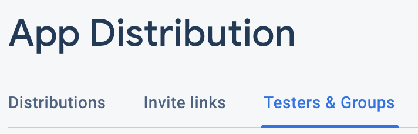
</p>

3. Simply type target email addresses.
<p align="left" style="padding-left: 15px">
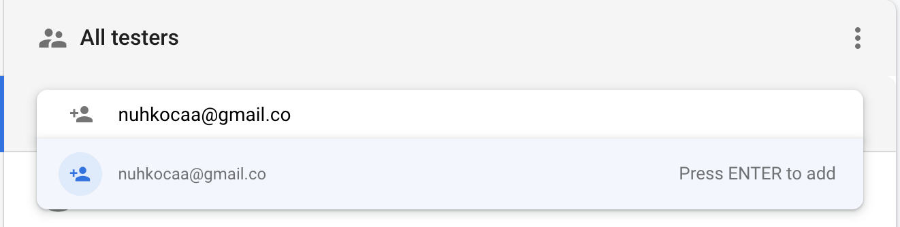
</p>

#### Create an invite link

1. You can also create invite link to allow new testers to sign up via this custom link
<p align="left" style="padding-left: 15px">
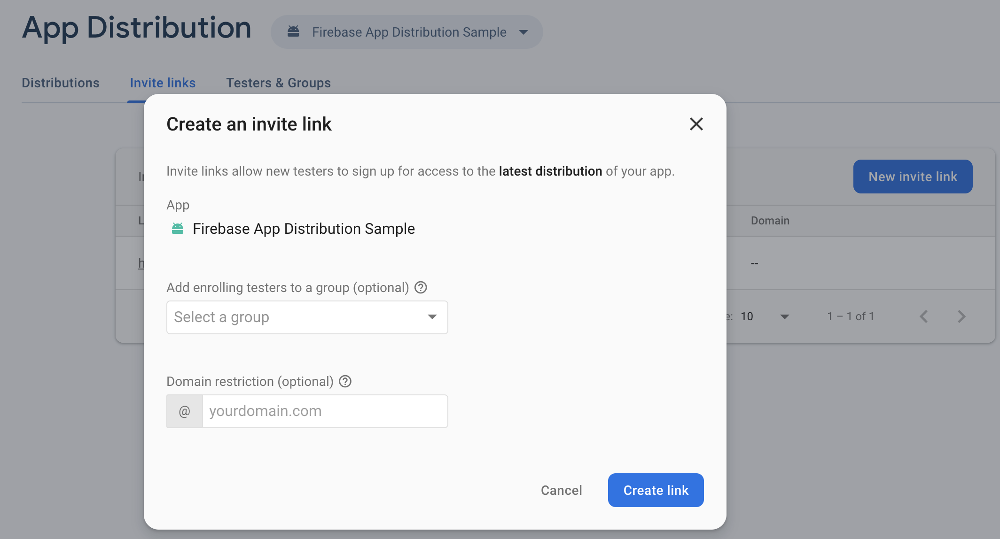
</p>

#### Distribute app to testers

1. Rather like you provide your **.apk** file manually, fastlane will upload apk files to this part when you [run the command](#run-the-lane). Here you can see list of previous distributions and number of invited, accepted and downloaded persons.
<p align="left" style="padding-left: 15px">
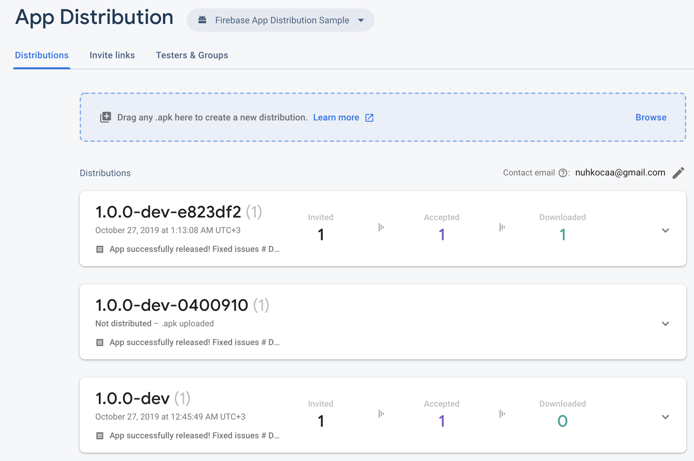
</p>

When you expand any distribution you will see email addresses which were invited and release notes.
<p align="left">
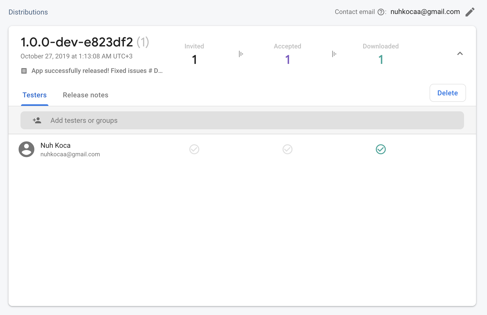
</p>

2. Most important part, when you upload your apk to Firebase console, you need to manually distribute it to your testers as following:
<p align="left" style="padding-left: 15px">
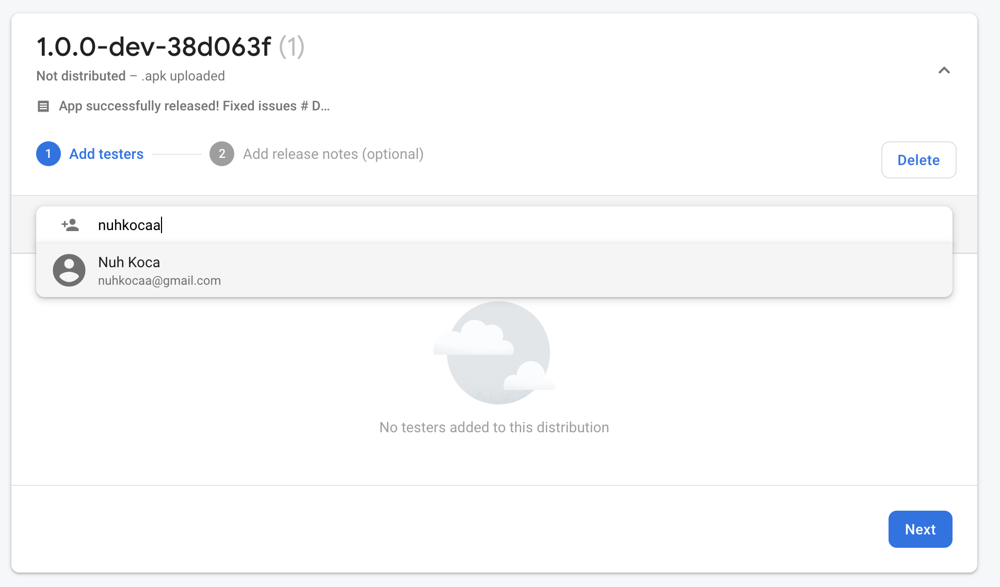
</p>

After you add testers, click **Next**.

3. Click **Distribute to N tester**.
<p align="left" style="padding-left: 15px">
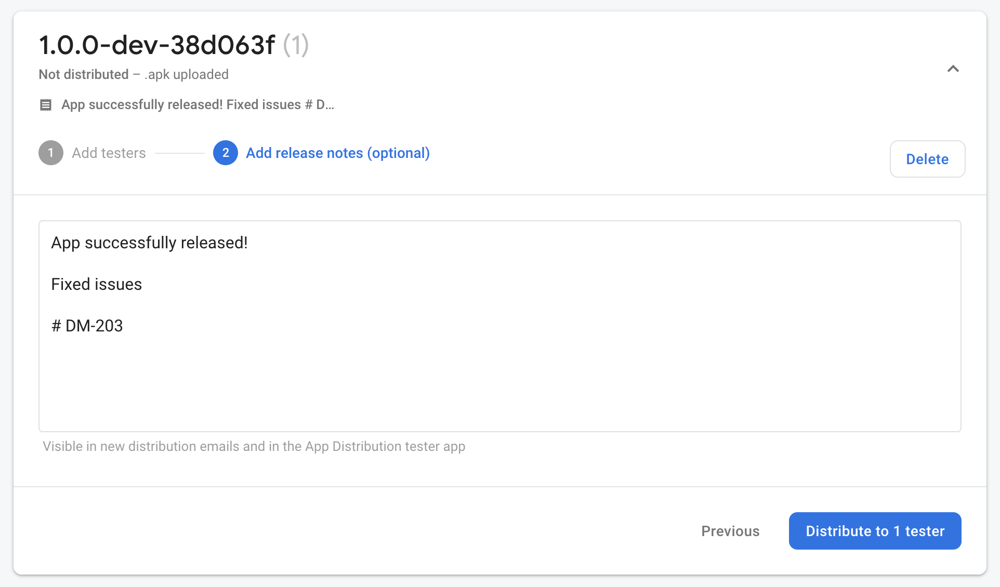
</p>

4. Distribution is successful. Now let's check it out on our email. Please navigate to [Android Device side](#android-device-side)

Android Device side
-------------------

The last part is to download our app after getting an aler email that indicates the application has a new release.

#### Download app via email

1. Open email address that is registered on the console.
2. Your email would probably look like;
<p align="left" style="padding-left: 15px">
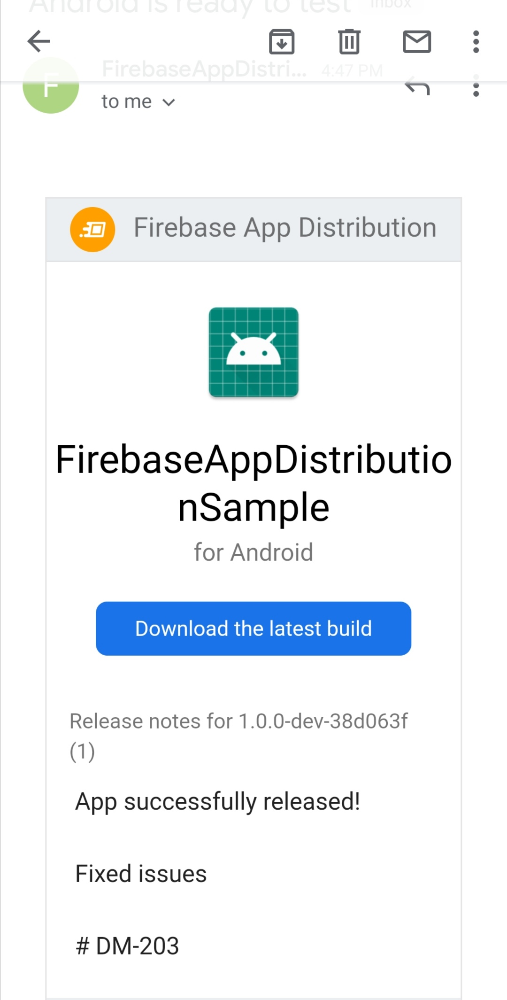
</p>

3. Click **Download the latest build**
4. If you don't still install **App Tester app**, it will probably prompt you to first install it and then receive release.

#### Access app via App Tester

1. Open **App Tester** app.
2. You will probably see a page which look like;
<p align="left" style="padding-left: 15px">
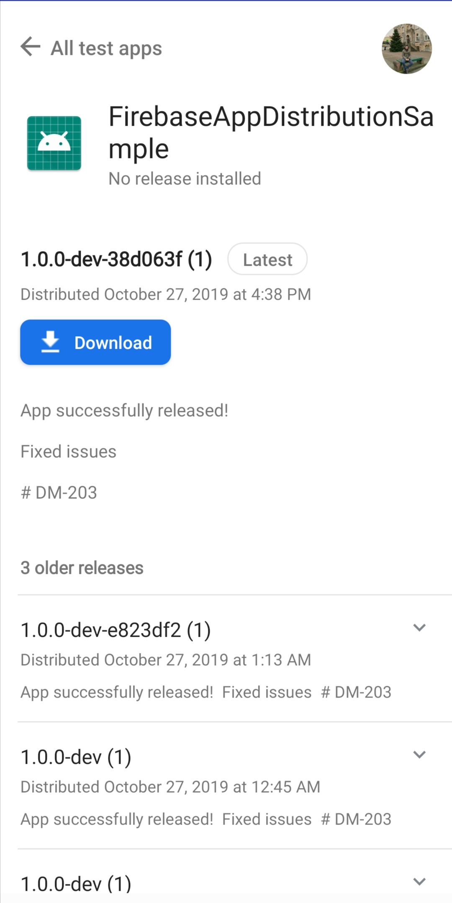
</p>

3. Click **Download**
4. :confetti_ball: Yay! You have the latest pre_prod release on your device!

Run the lane
------------

:boom: Just type below command and our app will be distributed in a while :confetti_ball:

   `fastlane distribute` 
 
For a faster execution, you could type:
   
   `bundle exec fastlane distribute`
   
   **...And the result!**
   
   <p align="left">
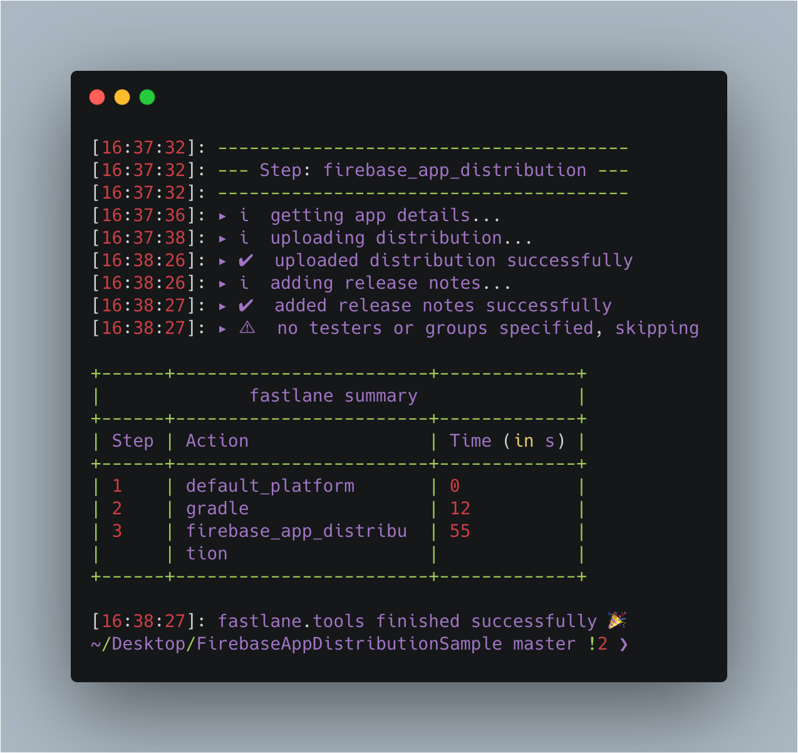
</p>

Plugins - Bonus*
================

Increment Version Code
----------------------

[increment_version_code](https://github.com/Jems22/fastlane-plugin-increment_version_code) is a **fastlane** plugin that helps to increment version code in each release. This usually is used in **Deploy to Play Store** part. In this example, I used it in Firebase distribution part to imitate the scenario.

   ```
   increment_version_code(
        gradle_file_path: "./app/build.gradle"
    )
   ```
   
Get Version Name
----------------

Sometimes you might need to checkout a new branch after you distributed your application. In case of that, branch names usually have version name as a suffix to make it clear. [get_version_name](https://github.com/Jems22/fastlane-plugin-get-version-name) helps you do so...

An example:

```
new_version = get_version_name(
  gradle_file_path:"./app/build.gradle",
  ext_constant_name:"versionName"
)
```
   
dotenv
------

[dotenv](https://github.com/bkeepers/dotenv) basically shims to load environment variables from *.env* into *ENV* in development. To install it, just type below command on terminal;

`sudo gem install -n /usr/local/bin dotenv`

If it asks you some permissions, grant it otherwise it won't continue.

Since we have a sensitive data called **Firebase App Id** we need to store it in a *.env* file. Therefore, **fastlane** will access and read content directly. We need to follow steps below in order;

1. Create a **.env.secret** file inside *fastlane folder*
2. Add ``.env.secret* to your .gitignore` file (if you are using git)
3. Manually load *.env.secret* in the `before_all block in your ``*Fastfile**

```
# fastlane/Fastfile
fastlane_require 'dotenv'

before_all do
  Dotenv.overload '.env.secret'
end
```

```
lane :distribute do               
  firebase_app_distribution(
      app: ENV['FIREBASE_APP_ID'],
      ...
    )
end
```

That's it! Fastlane will automatically read our value from the file and distribute a release without any error.
   
Resources
=========

Resources that I benefit from to create this comprehensive documentation.

* [Firebase App Distribution Page](https://firebase.google.com/docs/app-distribution/android/distribute-console)
* [Firebase App Distribution and Fastlane, too fast too furious!](https://medium.com/@ryanisnhp/firebase-app-distribution-and-fastlane-5303c17b4395)
* [Automating the Android Build and Release Process using Fastlane -Part I](https://proandroiddev.com/automating-the-android-build-and-release-process-using-fastlane-part-i-fb3ce61b678)
* [Fastlane Page](https://fastlane.tools/)
* [How to use Firebase on Android without the google-services plugin](https://medium.com/@samstern_58566/how-to-use-firebase-on-android-without-the-google-services-plugin-93ecc7dc6c4)
* [Add Firebase to your Android project](https://firebase.google.com/docs/android/setup)
* [Increment version code plugin](https://github.com/Jems22/fastlane-plugin-increment_version_code)
* [Get version name plugin](https://github.com/Jems22/fastlane-plugin-get-version-name)
* [carbon.now.sh](https://carbon.now.sh/)

Find this docs useful?
======================

Find this docs useful? :heart: 

Support it by joining [stargazers](https://github.com/nuhkoca/kotlin-android-fastlane-firebase-app-distribution/stargazers) for this repository. :star: 

And [follow](https://github.com/nuhkoca) me for my next creations! 🤩
   
License
=======

```
Apache License

/*
 * Designed and developed by 2019 nuhkoca (Nuh Koca)
 *
 * Licensed under the Apache License, Version 2.0 (the "License");
 * you may not use this file except in compliance with the License.
 * You may obtain a copy of the License at
 *
 * http://www.apache.org/licenses/LICENSE-2.0
 *
 * Unless required by applicable law or agreed to in writing, software
 * distributed under the License is distributed on an "AS IS" BASIS,
 * WITHOUT WARRANTIES OR CONDITIONS OF ANY KIND, either express or implied.
 * See the License for the specific language governing permissions and
 * limitations under the License.
 */
```